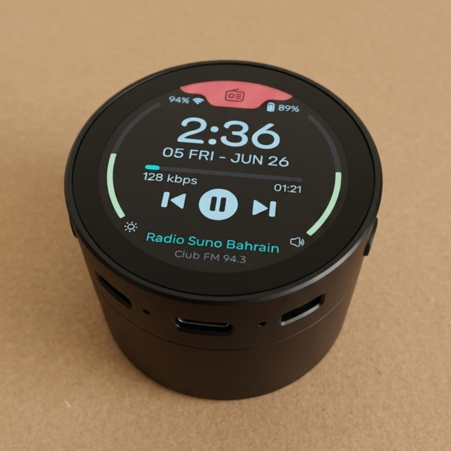

# WaveShare-2.41

---
<p align="center">
  <span style="color: yellow;">If you like this, consider supporting it:</span>
</p>

<p align="center">
  <a href="https://www.buymeacoffee.com/nishad2m8" target="_blank">
    
  </a>
  <a href="https://www.youtube.com/channel/UCV_35rUyf4N5mHZXaxaFKiQ" target="_blank">
    
  </a>
</p>

---

Check [OBP](https://github.com/nishad2m8/Squareline-OBP) for Squareline Studio Open Board Platform

---

### ❗Copy all the `libraries` to the project's `lib` folder.

```
Project/
├── lib/
│   ├── Audio_ES8311/
│   ├── Audio_PCM5101/
│   ├── BAT_Driver/
│   .
│   ├── lvgl/
│   └── ui/
├── src/
│   └── main.cpp
```

### Music Player:
Change the hardware version in `platformio.ini`
```ini
; Select hardware version: V1 or V2
[platformio]
default_envs = V1
```

| No.  | Thumb | Youtube URL |
| ------|-----|----------|
| 1 | | https://youtu.be/RMRKeBdVx6M|

<!-- | No | Thumb  | URL |  -->